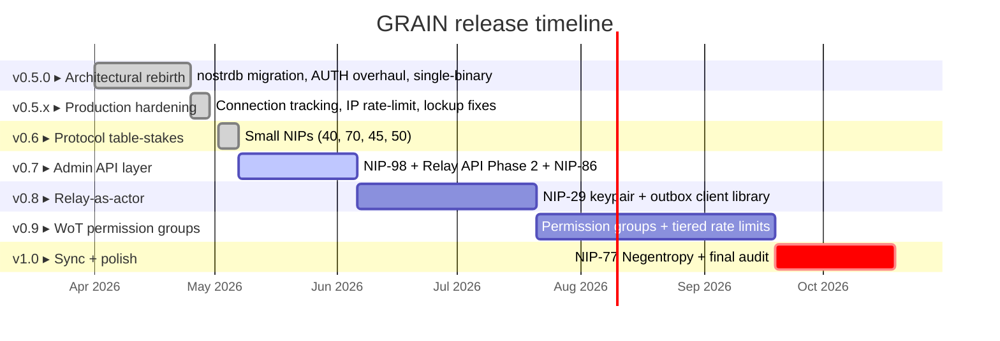

# 🌾 GRAIN Roadmap to 1.0

> **The path from today (`v0.6.0`) to a 1.0 release.** This document is the human-readable map; the [GitHub milestones](https://github.com/0ceanSlim/grain/milestones) are the source of truth for individual issues.

---

## 📍 Where we are

**v0.6.0 just shipped.** v0.5 closed out the architectural rebirth (MongoDB → embedded `nostrdb`, single-binary, proactive NIP-42 AUTH, client library beta) over April; v0.5.1–v0.5.4 hardened production bugs surfaced under real load (connection-tracking, REQ backpressure, IP blacklist + per-IP rate limiter); v0.6.0 burned down the missing core NIPs (40, 50, 70, 45). **v0.7 is current.**

---

## 🗺️ Timeline

---

## 🎯 Milestones

###  Architectural rebirth

**Theme:** Single-binary relay with embedded storage and proactive auth.

Dropped the external MongoDB dependency, integrated a custom `nostrdb` fork (`grain-delete`) with real-time physical deletion, embedded the dashboard into the binary, and completed the NIP-42 AUTH flow. v0.5.1 → v0.5.4 followed with critical production fixes: connection-counter underflow, upstream relay pool top-up, REQ backpressure, NIP-42 trailing-slash normalization, NIP-65 outbox-relay mute-list fetch, IP blacklist + per-IP rate limiter, Docker volume path, and the addressable-tag round-trip bug.

📂 [View milestone →](https://github.com/0ceanSlim/grain/milestone/1)

---

###  Protocol table-stakes

**Theme:** Burn down the "missing small NIPs" complaints in one go.

All four shipped, plus a handful of hardening fixes uncovered while running v0.5.4 at scale (slow-consumer disconnects, filter scratch buffer for large pubkey arrays, NIP-42 normalization round 2 with `relay_url_match` knob, NIP-01 OK-prefix correctness for duplicate / replaceable rejections, `logging.stdout` for Docker, app-level `PING`/`PONG`).

| # | Issue | Status |
|---|-------|--------|
| [#49](https://github.com/0ceanSlim/grain/issues/49) | NIP-40 Expiration Timestamp | ✅ closed |
| [#52](https://github.com/0ceanSlim/grain/issues/52) | NIP-70 Protected Events | ✅ closed |
| [#53](https://github.com/0ceanSlim/grain/issues/53) | NIP-45 Event Counts (`COUNT`) | ✅ closed |
| [#48](https://github.com/0ceanSlim/grain/issues/48) | NIP-50 Search capability | ✅ closed |

📂 [View milestone →](https://github.com/0ceanSlim/grain/milestone/2)

---

###  Admin API layer

**Theme:** Operators get a remote-management story — plus the deferred mute-list and protocol-cleanup items.

A self-contained dependency chain. Independent of everything else — by now the relay has enough surface area to benefit from remote management, and admins feel the pain today. Folded in: the per-author parallel mute-list refresh deferred from v0.5, the geo-blocking item also deferred from v0.5, and two protocol-correctness items surfaced during the v0.6 production run.

| # | Issue | Scope |
|---|-------|-------|
| [#50](https://github.com/0ceanSlim/grain/issues/50) | NIP-98 HTTP Auth | Foundation for the next two |
| [#43](https://github.com/0ceanSlim/grain/issues/43) | Relay API Phase 2 (POST/DELETE) | Uses NIP-98 |
| [#51](https://github.com/0ceanSlim/grain/issues/51) | NIP-86 Relay Management API | Uses NIP-98 |
| [#60](https://github.com/0ceanSlim/grain/issues/60) | Admin private mute list sync | Uses NIP-98; finishes #58 |
| [#63](https://github.com/0ceanSlim/grain/issues/63) | Parallelize per-author mute-list refresh | Deferred from v0.5 |
| [#64](https://github.com/0ceanSlim/grain/issues/64) | Geo/region blocking via GeoIP | Deferred from v0.5 |
| [#72](https://github.com/0ceanSlim/grain/issues/72) | nostrdb author/id prefix-filter compliance | Surfaced during v0.6 prod run |

📂 [View milestone →](https://github.com/0ceanSlim/grain/milestone/3)

---

###  Relay-as-actor

**Theme:** GRAIN becomes a first-class Nostr citizen.

The architectural prerequisite for WoT. NIP-29 ships with a relay-owned keypair that gives GRAIN its own identity; the client library graduates from beta with full outbox-model routing.

| # | Issue | Scope |
|---|-------|-------|
| [#55](https://github.com/0ceanSlim/grain/issues/55) | NIP-29 Relay-based Groups (+ relay keypair) | Identity foundation |
| [#56](https://github.com/0ceanSlim/grain/issues/56) | Client library: outbox-model relay pool | Library GA |

📂 [View milestone →](https://github.com/0ceanSlim/grain/milestone/4)

---

###  WoT permission groups

**Theme:** The killer feature.

Composable permission groups built from any combination of explicit whitelist, WoT membership, score thresholds, AUTH state, and admin pubkey. Each group gets its own access, retention, and rate-limit policy. Depends entirely on v0.8.

| # | Issue | Scope |
|---|-------|-------|
| [#14](https://github.com/0ceanSlim/grain/issues/14) | WoT / permission groups | Group model + scoring |
| [#57](https://github.com/0ceanSlim/grain/issues/57) | Per-group rate-limit tiers | Built on the group model |

📂 [View milestone →](https://github.com/0ceanSlim/grain/milestone/5)

---

###  Sync + polish

**Theme:** The last protocol addition, then ship.

NIP-77 Negentropy is the most complex protocol work in the roadmap; it goes here so that if anything must slip, it slips. Final audit, migration docs, NIP-11 cleanup.

| # | Issue | Scope |
|---|-------|-------|
| [#47](https://github.com/0ceanSlim/grain/issues/47) | NIP-77 Negentropy | Set reconciliation / efficient sync |

📂 [View milestone →](https://github.com/0ceanSlim/grain/milestone/6)

---

## 🪧 Out of scope for 1.0

These were considered and intentionally deferred:

- **NIP-26 (Delegated Event Signing)** — the ecosystem has largely abandoned NIP-26; few clients still implement it. Tagged `Low Priority`, not blocking 1.0. ([#54](https://github.com/0ceanSlim/grain/issues/54))
- **Per-kind blacklisting (NIP-51 kind:30007)** — already achievable via existing `rate_limit.kind_limits` set to 0 per kind. No new feature needed.
- **Whitelist words & relays** ([#18](https://github.com/0ceanSlim/grain/issues/18)) — likely collapses into a permission-group predicate once #14 lands; revisit then.
- **nspam classifier integration** ([#59](https://github.com/0ceanSlim/grain/issues/59)) — nice-to-have spam scoring; post-1.0.
- **Metrics dashboard / endpoints** ([#12](https://github.com/0ceanSlim/grain/issues/12)) — `Good First Issue`, no milestone, post-1.0 if not picked up before. Folds in the v0.5.3 memory-pressure metric work (closed #66) and the v0.6 `setResourceLimit.go` warn-spam follow-up.
- **NIP-50 configurable indexed kinds** ([#71](https://github.com/0ceanSlim/grain/issues/71)) — fork-side work to expand fulltext indexing beyond kinds 1 & 30023 (e.g. kind 0 profile metadata, operator-defined custom kinds). Stretch for v0.8 if time allows; otherwise post-1.0.

---

## 🔄 How this doc stays current

- Every issue tagged `1.0 Requirement` is also assigned a milestone (`v0.7` through `v1.0`).
- This file is updated on milestone close: flip the section header status badge to `shipped`, move the next milestone to `current`, summarise what shipped.
- For day-to-day status, prefer the [milestones page](https://github.com/0ceanSlim/grain/milestones) — it auto-counts open vs. closed.
- Disagree with the sequencing? Open an issue or comment on the relevant milestone.

---

Last revised after shipping v0.6.0 (2026-05-07): closed milestones v0.5.0 and v0.6, promoted v0.7 to current, folded #63/#64/#72 into v0.7 and #71 into out-of-scope.
