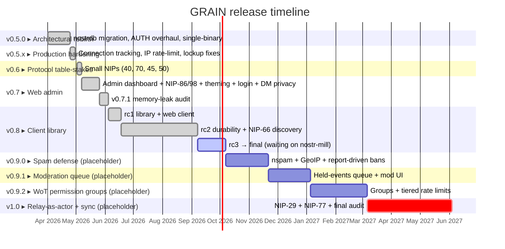

# 🌾 GRAIN Roadmap to 1.0

> **The path from today (`v0.8.0-rc`) to a 1.0 release.** This document is the human-readable map; the [GitHub milestones](https://github.com/0ceanSlim/grain/milestones) are the source of truth for individual issues.

---

## 📍 Where we are

**v0.8 is feature-complete and in release candidates.** rc1 (2026-06-18) shipped the importable client library and the web client built on it; rc2 (2026-09-07) fixed the durability and retention bugs a live relay surfaced and added self-discovering NIP-66 relay monitors; rc3 closes out the last two v0.8 issues (#101 docs, #104 discovery) with a Discovery settings tab and the profile-page ban button. The **final v0.8.0** waits on one more change to the `nostr-mill` signer component, so expect at least one more candidate first.

Before that: v0.5 closed out the architectural rebirth (MongoDB → embedded `nostrdb`, single-binary, proactive NIP-42 AUTH, client library beta); v0.5.1–v0.5.4 hardened production under real load; v0.6.0 burned down the missing core NIPs (40, 50, 70, 45); v0.7.0 delivered web-based relay administration; v0.7.1 (2026-06-04) was the goroutine/connection memory-leak audit.

> **Pace note.** grain is not full-time work right now. The dates below for v0.9 and v1.0 are placeholders for ordering, not commitments. v0.9 is split into three point releases, with spam defense and Web-of-Trust access control first.

---

## 🗺️ Timeline

```mermaid
gantt
    title GRAIN release timeline
    dateFormat  YYYY-MM-DD
    axisFormat  %b %Y

    section v0.5.0 ▸ Architectural rebirth
    nostrdb migration, AUTH overhaul, single-binary    :done, v05, 2026-04-01, 2026-04-25

    section v0.5.x ▸ Production hardening
    Connection tracking, IP rate-limit, lockup fixes   :done, v05x, 2026-04-25, 2026-04-30

    section v0.6 ▸ Protocol table-stakes
    Small NIPs (40, 70, 45, 50)                        :done, v06, 2026-05-02, 2026-05-07

    section v0.7 ▸ Web admin
    Admin dashboard + NIP-86/98 + theming + login + DM privacy :done, v07, 2026-05-07, 2026-05-26
    v0.7.1 memory-leak audit                           :done, v071, 2026-05-26, 2026-06-04

    section v0.8 ▸ Client library
    rc1 library + web client                           :done, v08a, 2026-06-04, 2026-06-18
    rc2 durability + NIP-66 discovery                  :done, v08b, 2026-06-18, 2026-09-07
    rc3 → final (waiting on nostr-mill)                :active, v08c, 2026-09-07, 30d

    section v0.9.0 ▸ Spam defense (placeholder)
    nspam + GeoIP + report-driven bans                 :v090, after v08c, 45d

    section v0.9.1 ▸ Moderation queue (placeholder)
    Held-events queue + mod UI                         :v091, after v090, 45d

    section v0.9.2 ▸ WoT permission groups (placeholder)
    Groups + tiered rate limits                        :v092, after v091, 60d

    section v1.0 ▸ Relay-as-actor + sync (placeholder)
    NIP-29 + NIP-77 + final audit                      :crit, v10, after v092, 90d
```

---

## 🎯 Milestones

###  Architectural rebirth

**Theme:** Single-binary relay with embedded storage and proactive auth.

Dropped the external MongoDB dependency, integrated a custom `nostrdb` fork (`grain-delete`) with real-time physical deletion, embedded the dashboard into the binary, and completed the NIP-42 AUTH flow. v0.5.1 → v0.5.4 followed with critical production fixes: connection-counter underflow, upstream relay pool top-up, REQ backpressure, NIP-42 trailing-slash normalization, NIP-65 outbox-relay mute-list fetch, IP blacklist + per-IP rate limiter, Docker volume path, and the addressable-tag round-trip bug.

📂 [View milestone →](https://github.com/0ceanSlim/grain/milestone/1)

---

###  Protocol table-stakes

**Theme:** Burn down the "missing small NIPs" complaints in one go.

All four shipped, plus a handful of hardening fixes uncovered while running v0.5.4 at scale (slow-consumer disconnects, filter scratch buffer for large pubkey arrays, NIP-42 normalization round 2 with `relay_url_match` knob, NIP-01 OK-prefix correctness for duplicate / replaceable rejections, `logging.stdout` for Docker, app-level `PING`/`PONG`).

| # | Issue | Status |
|---|-------|--------|
| [#49](https://github.com/0ceanSlim/grain/issues/49) | NIP-40 Expiration Timestamp | ✅ closed |
| [#52](https://github.com/0ceanSlim/grain/issues/52) | NIP-70 Protected Events | ✅ closed |
| [#53](https://github.com/0ceanSlim/grain/issues/53) | NIP-45 Event Counts (`COUNT`) | ✅ closed |
| [#48](https://github.com/0ceanSlim/grain/issues/48) | NIP-50 Search capability | ✅ closed |

📂 [View milestone →](https://github.com/0ceanSlim/grain/milestone/2)

---

###  Web-based relay administration

**Theme:** Operate the relay from a browser — live config, reworked login, restyle — all on a signed admin API.

Shipped 2026-05-26. A full owner-gated **`/admin` dashboard** that tunes every config section live, built on **NIP-98** signed HTTP auth and the **NIP-86** management API ([#76](https://github.com/0ceanSlim/grain/issues/76)). Alongside it: an instant, signer-persistent **login rework** on the `nostr-mill` web component ([#86](https://github.com/0ceanSlim/grain/issues/86), [#81](https://github.com/0ceanSlim/grain/issues/81)); a seven-theme **design-token restyle** ([#88](https://github.com/0ceanSlim/grain/issues/88)); **DM privacy by default** ([#73](https://github.com/0ceanSlim/grain/issues/73)); browser-decrypted **private mute-list sync** ([#60](https://github.com/0ceanSlim/grain/issues/60)); parallelized mute-list refresh ([#63](https://github.com/0ceanSlim/grain/issues/63), [#85](https://github.com/0ceanSlim/grain/issues/85)); multiple backup relays; and first-run owner provisioning via `GRAIN_OWNER_PUBKEY` / `/setup`.

**v0.7.1** (2026-06-04) followed as a hardening patch: a goroutine / connection memory-leak audit ([#92](https://github.com/0ceanSlim/grain/issues/92)–[#95](https://github.com/0ceanSlim/grain/issues/95)).

| # | Issue | Status |
|---|-------|--------|
| [#76](https://github.com/0ceanSlim/grain/issues/76) | Relay admin dashboard (live config UI) | ✅ closed |
| [#50](https://github.com/0ceanSlim/grain/issues/50) | NIP-98 HTTP Auth | ✅ closed |
| [#43](https://github.com/0ceanSlim/grain/issues/43) | Relay API Phase 2 (POST/DELETE) | ✅ closed |
| [#51](https://github.com/0ceanSlim/grain/issues/51) | NIP-86 Relay Management API | ✅ closed |
| [#86](https://github.com/0ceanSlim/grain/issues/86) | Login/signer rework (instant + persistent) | ✅ closed |
| [#73](https://github.com/0ceanSlim/grain/issues/73) | NIP-17 DM privacy (kind:1059 recipient-only) | ✅ closed |
| [#60](https://github.com/0ceanSlim/grain/issues/60) | Admin private mute-list sync | ✅ closed |
| [#63](https://github.com/0ceanSlim/grain/issues/63) | Parallelize per-author mute-list refresh | ✅ closed |

📂 [View milestone →](https://github.com/0ceanSlim/grain/milestone/3) · [v0.7.1 →](https://github.com/0ceanSlim/grain/milestone/10)

---

###  Client library + web client

**Theme:** grain becomes a full Nostr client, and the library it's built on.

Originally scoped as "relay-as-actor" (NIP-29 + relay keypair), v0.8 became the **client-library release** instead. The headline is **`client/core`**: an importable, outbox-model client engine in pure Go with a leased relay pool, role-based routing, streaming fetches, pluggable Signer / Logger / RelayListStore seams, and `context.Context` throughout. The bundled web client is the **reference consumer**: profile editing, relay management with a known-relays browser, media servers (Blossom + NIP-96), native **NIP-44** v2 + v3 encryption, **NIP-42** relay AUTH, NIP-65/17/51/37 relay lists, and **NIP-89** client tags.

Running rc1 on a live relay produced rc2's second half: the **durability bucket** (retention purge that actually drains, an LMDB map-usage gauge with pre-full write rejection, `MDB_NOTLS` reader stability, writer-failure visibility, a 64 GB default map), NIP-11 served from live config, self-repairing legacy configs, and **NIP-66 relay monitors** as a self-discovering, consensus-filtered source for the relay browser ([#104](https://github.com/0ceanSlim/grain/issues/104)). rc3 adds the Discovery settings tab, an on-demand discovery pass, the owner-only **Ban** button on profile pages (the self-contained slice of [#105](https://github.com/0ceanSlim/grain/issues/105)), and the full client-library guide ([#101](https://github.com/0ceanSlim/grain/issues/101), [docs/client-library-guide.md](docs/client-library-guide.md)).

**Moved out:** NIP-29 + relay keypair ([#55](https://github.com/0ceanSlim/grain/issues/55)) and the nostrdb prefix-filter fix ([#72](https://github.com/0ceanSlim/grain/issues/72)) to v1.0, geo/region blocking ([#64](https://github.com/0ceanSlim/grain/issues/64)) to v0.9.0. None of them is client-library work, and WoT no longer needs the relay keypair first (the owner pubkey from v0.7 is the graph root).

| # | Issue | Scope |
|---|-------|-------|
| [#56](https://github.com/0ceanSlim/grain/issues/56) | Client library: outbox-model relay pool with role-based routing | ✅ closed |
| [#77](https://github.com/0ceanSlim/grain/issues/77) | Streaming + concurrent multi-relay fetch path, lazy UI hydration | ✅ closed |
| [#87](https://github.com/0ceanSlim/grain/issues/87) | Stream user-data hydration after login (SSE) | ✅ closed |
| [#98](https://github.com/0ceanSlim/grain/issues/98) | Dedicated relay settings page + connections dropdown | ✅ closed |
| [#102](https://github.com/0ceanSlim/grain/issues/102) | Known-relays browser (NIP-11 + ping sort), add-relay autocomplete | ✅ closed |
| [#100](https://github.com/0ceanSlim/grain/issues/100) | NIP-51/37 encrypted relay lists, native NIP-44 v2 + v3 | ✅ closed |
| [#83](https://github.com/0ceanSlim/grain/issues/83) | Media server lists (Blossom + NIP-96): resolve + upload | ✅ closed |
| [#99](https://github.com/0ceanSlim/grain/issues/99) | NIP-89 client tag: default-on, admin config, per-user opt-out | ✅ closed |
| [#90](https://github.com/0ceanSlim/grain/issues/90) | Profile page: restyle + in-place editing / signing | ✅ closed |
| [#74](https://github.com/0ceanSlim/grain/issues/74) | Profile page styling vs. design tokens | ✅ closed |
| [#80](https://github.com/0ceanSlim/grain/issues/80) | Dashboard: client config section | ✅ closed |
| [#104](https://github.com/0ceanSlim/grain/issues/104) | Self-discovering NIP-66 monitor pool (fix the 7k known-relays growth) | ✅ closed |
| [#101](https://github.com/0ceanSlim/grain/issues/101) | Client library docs: everything achievable as of 0.8.0 | ✅ closed |

**Remaining for final:** one more `nostr-mill` change, then the final release combining every rc's notes into one body.

📂 [View milestone →](https://github.com/0ceanSlim/grain/milestone/4)

---

###  Spam defense

**Theme:** Automated blocking that hooks what already exists — no new data model.

The first relay-side release after the client cycle, and the fastest path to production value. Every item here is a hook into the existing blacklist cache and the temp-to-perma escalation the word filter already uses. Report-driven bans ship their **author-level** half here; the event-level half needs the moderation queue and follows in v0.9.1.

| # | Issue | Scope |
|---|-------|-------|
| [#59](https://github.com/0ceanSlim/grain/issues/59) | nspam classifier: score-based auto-blacklist | Spam scoring at ingest |
| [#97](https://github.com/0ceanSlim/grain/issues/97) | Report-driven moderation: temp/perma bans from NIP-56 reports | Author-level target (event-level in v0.9.1) |
| [#64](https://github.com/0ceanSlim/grain/issues/64) | Geo/region blocking via GeoIP | Connection-level blocking |

📂 [View milestone →](https://github.com/0ceanSlim/grain/milestone/11)

---

###  Moderation queue

**Theme:** The first new data model — a held-events table and the tooling on top of it.

The queue backs the four NIP-86 event-moderation methods, gives report-driven bans their event-level target, and gets a dashboard section with approve / ban actions and a ban list with reasons. The owner-only Ban button on profile pages, the self-contained slice of [#105](https://github.com/0ceanSlim/grain/issues/105), already shipped in v0.8.0-rc3; its observability and broadcast-DM items are independent polish that may slide to v1.0.

| # | Issue | Scope |
|---|-------|-------|
| [#84](https://github.com/0ceanSlim/grain/issues/84) | Event moderation queue (NIP-86 allowevent / banevent / listbannedevents / listeventsneedingmoderation) | Held-events table + methods |
| [#105](https://github.com/0ceanSlim/grain/issues/105) | Admin tooling: mod-queue UI, ban list, live log, richer metrics, broadcast DM | Dashboard side of the queue |

📂 [View milestone →](https://github.com/0ceanSlim/grain/milestone/12)

---

###  WoT permission groups

**Theme:** The killer feature.

Composable permission groups built from any combination of explicit whitelist, WoT membership, score thresholds, AUTH state, and admin pubkey. Each group gets its own access, retention, and rate-limit policy. The WoT graph roots at the relay owner's follow list (the owner pubkey has existed since v0.7), so the relay keypair from NIP-29 is no longer a prerequisite. The domain whitelist becomes a group predicate, and the word / relay whitelists either fold into the group model or close.

| # | Issue | Scope |
|---|-------|-------|
| [#14](https://github.com/0ceanSlim/grain/issues/14) | WoT / permission groups | Group model + scoring |
| [#57](https://github.com/0ceanSlim/grain/issues/57) | Per-group rate-limit tiers | Built on the group model |
| [#79](https://github.com/0ceanSlim/grain/issues/79) | Domain whitelist: per-name NIP-05 lookups | Whitelist as a group predicate |
| [#18](https://github.com/0ceanSlim/grain/issues/18) | Whitelist words & relays | Folds into #14 or closes |

📂 [View milestone →](https://github.com/0ceanSlim/grain/milestone/5)

---

###  Relay-as-actor, sync + polish

**Theme:** The heavy protocol additions, the compliance fixes, then ship.

NIP-29 and NIP-77 are the two heaviest protocol items in the roadmap and both sit here so that if anything must slip, it slips without holding the spam and WoT releases. The nostrdb fork compliance fixes belong to the final audit. Migration docs and NIP-11 cleanup close it out.

| # | Issue | Scope |
|---|-------|-------|
| [#55](https://github.com/0ceanSlim/grain/issues/55) | NIP-29 Relay-based Groups (+ relay keypair) | Relay-as-actor |
| [#47](https://github.com/0ceanSlim/grain/issues/47) | NIP-77 Negentropy | Set reconciliation / efficient sync |
| [#96](https://github.com/0ceanSlim/grain/issues/96) | NIP-62 Request to Vanish | Community request |
| [#72](https://github.com/0ceanSlim/grain/issues/72) | nostrdb author/id prefix-filter compliance | nostrdb fork change |
| [#71](https://github.com/0ceanSlim/grain/issues/71) | NIP-50 configurable indexed kinds | nostrdb fork change |
| [#12](https://github.com/0ceanSlim/grain/issues/12) | Metrics | Good first issue |
| [#54](https://github.com/0ceanSlim/grain/issues/54) | NIP-26 Delegated Event Signing | Low priority; likely won't-do |

📂 [View milestone →](https://github.com/0ceanSlim/grain/milestone/6)

---

## 🔭 Beyond 1.0

Planned, but explicitly *after* the 1.0 line — captured so the design isn't lost, not scheduled.

- **Rich event rendering + browsable views.** Kind-aware rendering (notes with inline media, long-form articles, reposts / reactions / zaps, badges, NIP-A3 payment targets, the NIP-51 list family, …) as a **reusable, importable** Go renderer with an API surface — plus the aggregate **thread** view (reply trees over NIP-22/NIP-10 with engagement) and the aggregate **profile** view built on the client's outbox subscriptions, so `/p/` becomes the real profile and `/e/` renders any kind. The outbox-backed *event resolution* underneath it may land earlier as a pre-1.0 query-robustness fix. Full design in **[#108](https://github.com/0ceanSlim/grain/issues/108)**.

- **Full-text search across the relay pool.** The top search bar, in addition to resolving identifiers, fans a free-text NIP-50 `search` query out to every connected NIP-50-capable relay and aggregates the results — network search, not just local lookup. Shape is TBD. ([#107](https://github.com/0ceanSlim/grain/issues/107))

---

## 🪧 Out of scope for 1.0

These were considered and intentionally deferred:

- **NIP-26 (Delegated Event Signing)** — the ecosystem has largely abandoned NIP-26; few clients still implement it. Tagged `Low Priority`, parked in v1.0 only until a won't-do decision is made. ([#54](https://github.com/0ceanSlim/grain/issues/54))
- **Per-kind blacklisting (NIP-51 kind:30007)** — already achievable via existing `rate_limit.kind_limits` set to 0 per kind. No new feature needed.
- **Routing-directory cap / LRU** — the memory-hygiene half of [#104](https://github.com/0ceanSlim/grain/issues/104) Phase 0. Dropped once NIP-66 monitors took over the browser; reopen as its own issue only if it shows up in a memory profile.

---

## 🔄 How this doc stays current

- Every issue tagged `1.0 Requirement` is also assigned a milestone (`v0.9.0` through `v1.0`).
- This file is updated on milestone close: flip the section header status badge to `shipped`, move the next milestone to `current`, summarise what shipped.
- For day-to-day status, prefer the [milestones page](https://github.com/0ceanSlim/grain/milestones) — it auto-counts open vs. closed.
- Disagree with the sequencing? Open an issue or comment on the relevant milestone.

---

Last revised 2026-09-17 ahead of v0.8.0-rc3: v0.8 reframed from "relay-as-actor" to the client-library release it became and closed out (#101 / #104); the old v0.9 grab-bag split into v0.9.0 spam defense, v0.9.1 moderation queue and v0.9.2 WoT permission groups (the former v0.9 milestone, renamed); NIP-29, NIP-62, the nostrdb compliance fixes, metrics and NIP-26 moved to v1.0; gantt re-based with placeholder bars. 2026-09-18: added the Beyond-1.0 section pointing at the event-rendering design doc. 2026-09-21: after v0.8.0-rc4, filed the Beyond-1.0 items as issues — rich event rendering (#108, spec moved into the issue) and full-text NIP-50 search across the relay pool (#107); removed the docs/design/ folder (dashboard spec obsolete — shipped; event-rendering spec now lives in #108).
